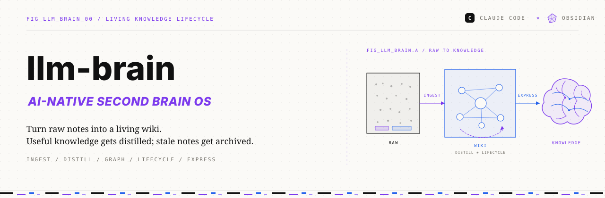
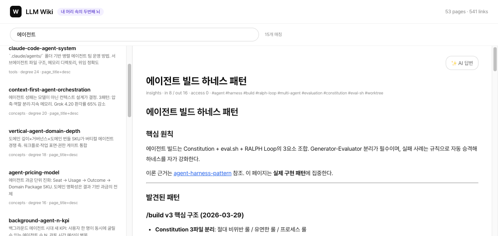
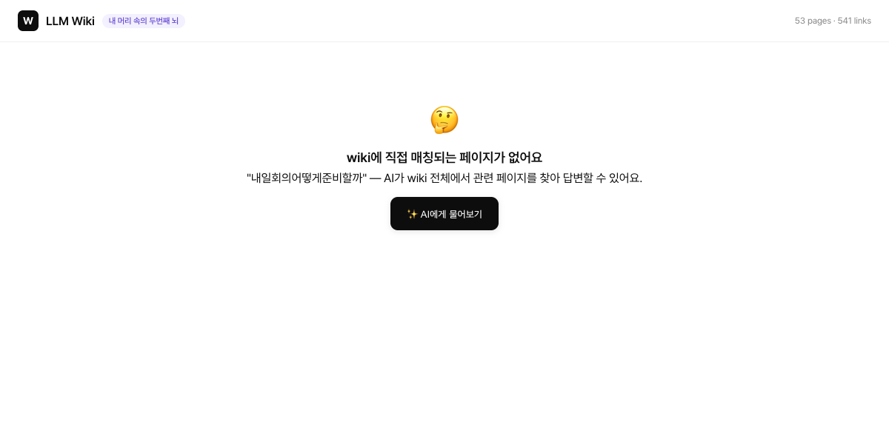
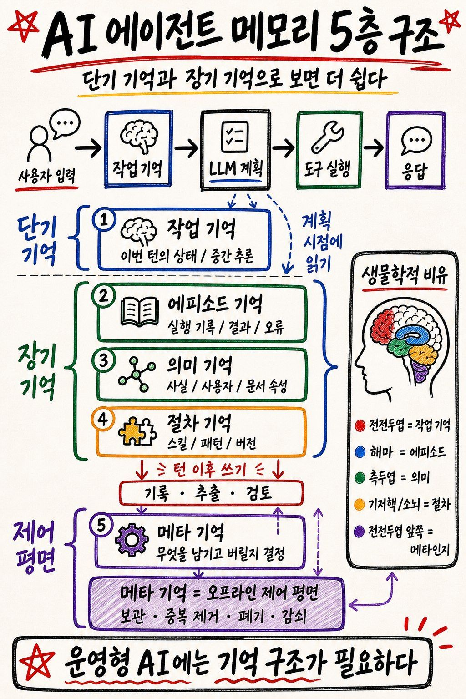

# llm-brain — 당신의 두 번째 뇌를 만드세요

> **메모·노트를 넣으면 AI가 정리된 지식 위키로 만들고, 필요할 때 글로 꺼내 쓰는 '두 번째 뇌' 도구.**
> LLM을 컴파일러(메모를 자동으로 정리해 주는 AI)처럼 써서, 흩어진 raw 메모를 구조화된 위키로 바꾼다.
> *Build your Second Brain with LLM as the compiler.*

**📌 매일 메모는 쌓이는데 한 달 뒤엔 어디 있는지 모르겠다면 — 그 메모를 AI가 정리·연결·검색·재활용해 주는 도구입니다. 코딩 지식이 없어도 됩니다.**


> 🎉 **v0.3** — Quality-Driven Curation: 매일 품질 점검·자동 보강(`curate --reweave`) · 신규 페이지 승격 게이트(Promotion Gates) · 여러 메모를 교차 종합(synthesis)하고 모순을 명시적으로 화해 · 입구에서 중복 차단(hard dedup) · cli/api 엔진 선택(`llm_client`).
> 🎉 **v0.2** — Agent Memory OS 5층 기억(작업·에피소드·의미·절차·메타) + 설치 점검 `/llm-brain:doctor` · 웹 UI `/llm-brain:wikiweb` 커맨드 추가.

---

## 왜 만들었나 *Why this exists*

매일 TIL(Today I Learned, 오늘 배운 것 메모)을 쓰고, 회의록을 남기고, 논문을 클리핑한다.
그런데 한 달 뒤, 그 지식은 어디 있는가?

*You write notes every day — but where does that knowledge go after a month?*

흩어진 메모는 쌓이기만 할 뿐 다시 꺼내 쓰기 어렵다. llm-brain은 이 메모들을 **AI가 자동으로 정리·연결**해 검색 가능한 위키로 만들고, 필요할 때 **글로 다시 꺼내 쓰게** 한다.

---

## 미리보기 *Preview*

로컬 HTML 검색·페이지뷰 (브라우저에서 위키를 둘러보는 화면, `uv run python -m wiki_app`):

| 검색 + 페이지 뷰 | 본문 grep 자동 확장 |
|---|---|
|  |  |

| 결과 0개 → AI CTA | AI 답변 모달 (live) |
|---|---|
|  |  |

> 한국어/영문 검색 · 결과 < 3개일 때 본문 grep(본문 전체 텍스트 검색) 자동 확장 · 페이지 뷰 + wikilink SPA 네비게이션(새로고침 없이 이동) · AI 답변 옵션 토글

---

## 준비물 *Prerequisites*

비전공자도 따라 할 수 있게, 필요한 **세 가지**를 하나씩 풀어 둔다.

**1. Claude Code** — 터미널에서 대화로 코드를 다뤄 주는 AI 도구. 이 위키의 'AI 컴파일러' 역할을 한다.
설치·안내(공식): <https://docs.claude.com/claude-code>

**2. uv** — 파이썬을 알아서 설치·실행해 주는 도구(복잡한 파이썬 환경 설정을 대행). 터미널에 아래 한 줄을 입력하면 설치된다:

```bash
curl -LsSf https://astral.sh/uv/install.sh | sh
```

**3. git** — 인터넷의 코드 저장소를 내 컴퓨터로 내려받는 도구. macOS·Linux는 보통 기본 설치돼 있다(macOS에 없으면 `xcode-select --install`).

용어 풀이:
- **레포(repository)** = 코드가 모여 있는 온라인 저장소. 이 프로젝트가 사는 '집'.
- **클론(clone)** = 그 레포를 통째로 내 컴퓨터에 복제하는 것. 명령은 `git clone <주소>`.

### 명령을 어디에 입력하나 *Where to type*

이 문서에는 두 종류의 명령이 섞여 나온다 — **입력하는 곳이 다르다.**

- `/llm-brain:...` 처럼 **슬래시로 시작**하는 명령 → **Claude Code 입력창**(대화창)에 입력
- `uv run ...` · `git clone ...` · `cp ...` 같은 명령 → **터미널**(명령줄, 곧 CLI)에 입력
  - 💡 터미널 여는 법: macOS는 `⌘+Space` → `Terminal` 검색 → 실행. (Windows는 `PowerShell`.)

> 아래 모든 코드 블록 옆에 ▶ 표시로 "어디에 입력하는지"를 적어 둔다.

---

## 설치 *Install*

▶ **Claude Code 입력창**에 입력 — 플러그인으로 설치한다:

```
/plugin marketplace add kimsanguine/llm-brain
/plugin install llm-brain@llm-brain
```

설치하면 컴파일러 커맨드가 추가된다 — `/llm-brain:ingest`·`/llm-brain:curate`·`/llm-brain:express`·`/llm-brain:query`·`/llm-brain:okf` · 설치 점검 `/llm-brain:doctor` · 웹 UI `/llm-brain:wikiweb`.

> 자기 지식 데이터를 다루려면 레포를 클론해 `raw/` 소스를 등록한다(아래 [빠른 시작](#빠른-시작-quick-start)). 플러그인은 *컴파일러 커맨드*를, 클론은 *자기 데이터*를 제공한다.

---

## 빠른 시작 *Quick Start*

[설치](#설치-install)로 커맨드를 받은 뒤, 레포를 클론한다:

▶ **터미널**에 입력:

```bash
git clone https://github.com/kimsanguine/llm-brain.git && cd llm-brain
```

아직 파일을 만들거나 개인 소스를 읽지 않고 운영 방식을 먼저 고르려면:

```bash
uv run python scripts/doctor.py --guided
uv run python scripts/doctor.py --guided --profile demo  # 프로필별 다음 행동 1개
```

프로필은 `Demo`, `Personal-private`, `Share-ready` 세 가지다. `Share-ready`는
canonical/local security 설정과 모든 후보의 명시적 scope를 확인한 뒤, 사람 승인 값을
포함한 별도 `--share` manifest gate 실행 하나만 다음 행동으로 안내한다.
`Demo` 프로필의 한 번짜리 명령은 브라우저 데모가 아니라 seed wiki를 읽을 수 있는지
확인하는 **설치 검증**이다. 실제 화면 체험은 바로 아래의 1분 체험 절차를 실행한다.
`Personal-private`는 `schema/sources.yaml`이 있으면 그 파일을, fresh clone처럼 없으면
`schema/sources.example.yaml` 템플릿을 읽기 전용으로 미리 보는 명령을 안내한다.

> 위 guided 동작은 llm-brain의 제품/개인 데이터(`raw/`, `wiki/`, 설정)를 만들거나
> 변경하지 않고 개인 콘텐츠를 스캔하지 않는다. 다만 명령 실행기인 `uv run`은 Python
> 환경이나 패키지 캐시를 생성·갱신할 수 있다.

### 1) 먼저 1분 체험 — 데모 위키 둘러보기 (추천)

설정 없이 동작을 먼저 본다. 예시 위키를 복사해 로컬 화면으로 바로 둘러보기:

▶ **터미널**에 입력:

```bash
cp -r examples/seed-wiki/wiki ./wiki            # 데모 wiki 복사
cp examples/seed-wiki/index.md ./index.md       # 데모 목차(index.md) 생성
uv run python -m wiki_app                        # 로컬 HTML UI → http://localhost:8000
```

(Obsidian으로 열려면 이 폴더를 "Open folder as vault".)

### 2) 내 메모로 운영하기

핵심 흐름은 **넣기 → 물어보기 → 꺼내쓰기** 3단계다.

**먼저, 내 메모가 어디 있는지 알려준다.** `schema/sources.yaml`(소스 등록 설정 파일)을 열어 내 메모 폴더 경로를 적는다. 파일 편집이 막막하면 **Claude Code 입력창에 자연어로** "내 옵시디언 폴더를 `schema/sources.yaml`에 등록해줘"라고 부탁해도 된다. (`raw/` = 아직 정리 안 된 원본 메모가 모이는 폴더.)

그다음 ▶ **Claude Code 입력창**에 입력:

```
/llm-brain:ingest               # ① 넣기: raw → wiki 자동 정리
/llm-brain:query "..."          # ② 물어보기: wiki 기반 답변
/llm-brain:express blog "..."   # ③ 꺼내쓰기: 글 초안 생성
```

---

## 핵심 기능 *Core Features*

쉬운 말로 6가지: **넣기(ingest) · 정리(curate) · 꺼내쓰기(express) · 물어보기(query) · 웹으로 보기(wiki-web) · 내보내기(okf)**.

### 📥 ingest — 넣기: 메모·파일·URL 모으기 *Capture · 4 Input Channels*

**한 줄로: 지식을 시스템에 '넣기'.** 메모·문서·웹페이지를 raw/(원본 보관함)에 모은다.

▶ `cp`는 **터미널**, `/llm-brain:ingest`는 **Claude Code 입력창**에 입력:

```bash
# 채널 1: 수동 투입 (MD · TXT · PDF · DOCX · PPTX) — 터미널
cp paper.pdf raw/docs/

# 채널 2: /llm-brain:ingest 슬래시 명령 (Claude Code 입력창)
/llm-brain:ingest https://example.com --resonance high
/llm-brain:ingest ~/Downloads/paper.pdf
/llm-brain:ingest "오늘 배운 것: ..."

# 채널 3 [고급·선택]: Obsidian vault 자동 미러링 (schema/sources.yaml = 소스 등록 설정 파일)
# 채널 4 [고급·선택]: Claude Code Routines 크론(예약 자동 실행) 등록
```

`--resonance high/medium/low`(중요도 태그)로 자료 중요도를 표시하고, index.md(전체 목차) 기반 중복 검사로 위키에 불필요한 중복이 쌓이는 것을 막는다.

---

### 🔁 curate — 정리: 압축·수명 관리 *Curate · Progressive Summarization*

**한 줄로: 쌓인 지식을 '정리'하기.** 자주 보는 페이지일수록 더 짧게 압축(distill, 압축 정리)하고, 오래 안 본 페이지는 archive(보관) 후보로 내린다. **v0.3부터는 시간이 아니라 품질로 정리한다** — 매일 약한 페이지를 자동 점검·보강하고, 여러 메모를 하나의 판단으로 종합하며, 새 근거가 옛 결론과 충돌하면 명시적으로 화해한다.

▶ **Claude Code 입력창**에 입력:

```
/llm-brain:curate --reweave     # (v0.3·매일 권장) 약한 페이지 점검 → 자동 보강 가능분은 즉시 수리
/llm-brain:curate --reweave --fix   # 자동 보강까지 실제 적용 (요약·근거수 등 기계적 결손)
/llm-brain:curate --distill     # 자주 본 페이지를 한 단계 더 압축 + 여러 소스 교차 종합
/llm-brain:curate --lifecycle   # 보관 기한(TTL) 지난 페이지를 archive 후보로
/llm-brain:curate --all         # 전체 실행 (점검 + 압축 + 수명 관리)
```

각 페이지는 frontmatter(페이지 머리말 정보)에 `distill_level`(압축 단계: 0=원문 → 3=한 줄)과 `access_count`(명시적으로 기록한 접근 횟수)를 둘 수 있다. 검색·페이지 보기·AI query는 이 값을 자동 변경하지 않는다. 접근을 집계하려면 별도의 `curate --record-access PAGE_SLUG`를 실행하고, 기록된 값은 distill 우선순위에 사용할 수 있다.

**v0.3 품질 정책** — 새 페이지는 **Promotion Gates**(반복 ≥2회·본문 ≥800자·근거 ≥2건 등)를 통과해야 정식 승격되고, 미달은 `wiki/observing/`(7일 유예)·`wiki/rejected/`로 라우팅된다. `--reweave`는 약한 노드(본문<800자·근거<2건)를 매일 잡아 기계적 결손만 자동 수리하고 판단이 필요한 건 큐로 남긴다(가짜 보강 금지). 여러 메모가 같은 주제를 건드리면 `## 인사이트 (종합)`으로 교차 종합하고, 모순이 감지되면 옛 주장을 지우지 않고 `## 반론/갱신` + `superseded` 표시로 화해한다.

> 압축 단계·접근 집계의 동작 방식, Promotion Gates·reweave·종합·모순 화해 규칙, wikilink 그래프(`wiki/graph.json`) 분석, Agent Memory OS의 선택 필드(`memory_type` 등)는 모두 자동 처리된다. 상세: `SPEC.md`.

---

### 📤 express — 꺼내쓰기: wiki → 창작물 *Express · Wiki to Output*

**한 줄로: 정리된 지식을 글로 '꺼내 쓰기'.** Second Brain의 존재 이유 — 블로그·강의안·요약·리포트 초안을 자동 생성한다.

▶ **Claude Code 입력창**에 입력:

```
/llm-brain:express blog "AI 에이전트 설계 패턴"
/llm-brain:express lecture "context-first-orchestration" --slides 5
/llm-brain:express summary --week
/llm-brain:express report "경쟁사 현황"
```

blog 출력은 `raw/blog/`에도 자동 복사 → 다음 ingest 사이클에 wiki로 피드백.

```
wiki/ → express/blog/ → raw/blog/ → wiki/   ← 피드백 루프
```

---

### 🔍 query — 물어보기: wiki 기반 답변 *Query · Wiki-grounded Answers*

**한 줄로: 내 지식에 '물어보기'.** wiki에 있는 current claim만 근거로 답한다 — 없으면 솔직히 "없다"고 한다(지어내지 않는다).

▶ **Claude Code 입력창**에서 자연어로 물어본다:

```
사용자: "RAG 구현할 때 뭐가 중요했지?"
Claude: wiki/ 내용 기반으로만 답변
        (wiki에 없으면 "raw 데이터가 필요합니다")
```

query는 읽기 전용이라 `raw/`·`wiki/`·`wiki_stats.json`·Canvas를 변경하지 않는다.
접근 통계나 Canvas 생성이 필요하면 query와 분리된 명시적 명령으로 실행한다.

v0.4 P0부터는 persisted `claims.jsonl`의 `active + trusted` claim 중 원래 raw SHA-256이
현재 bytes와 일치하는 근거만 답변과 `[claim:slug-N]`/`## 출처`에 사용할 수 있다.
`raw/newsletters/**`·`raw/clippings/**` 같은 외부 capture는 명령으로 해석할 수 없는
data-only JSON payload로 격리되며 인용할 수 없다.
source inventory가 persisted ledger와 다르면 전체 query를 막고, 민감한 statement/raw
경로 대신 영향받은 page slug 수와 `uv run python scripts/claims.py build` 복구 명령만
표시한다. usable trusted claim이 없으면 성공(`done`)이 아닌 `abstained`와 정확히
`관련 정보 없음`을 LLM 호출 없이 결정적으로 반환하며, 안전한 제외 사유별 건수와
다음 행동 하나를 제공한다. SSE도 LLM stream을 시작하지 않고 meta → abstention chunk
1개 → done 순서만 보낸다.

### 🌐 wiki-web — 웹으로 보기: HTML 검색·페이지뷰 *Local HTML Search UI*

**한 줄로: 위 query를 브라우저에서.** 검색창·페이지 보기·wikilink 클릭으로 위키를 둘러본다.

▶ **터미널**에 입력:

```bash
uv run python -m wiki_app
# → http://localhost:8000
```

- **검색**: 제목 + description + tags + page_title 점수 매칭, 결과 < 3개일 때 본문 grep(본문 전체 텍스트 검색) 자동 확장
- **페이지뷰**: 마크다운 렌더링 + `[[wikilink]]` 클릭 SPA 네비게이션(페이지 새로고침 없이 이동), 좌측 결과 리스트 유지
- **AI 답변 토글**: 결과 부족도에 비례해 CTA 강조 차등 (작은 버튼 / 노란 박스 / 큰 검정 버튼)
- **URL hash**: `#q=...&page=...` 형태로 검색·페이지 상태 보존, 새로고침 시 복원

검색·페이지 보기·AI query는 읽기 경로이며 `raw/`·`wiki/`·`wiki_stats.json`·접근 lock을
변경하지 않는다. 접근 통계는 명시적인 `curate --record-access PAGE_SLUG`에서만 기록한다.

스크린샷: `assets/screenshots/dod-*.png`

> AI 답변은 `claude -p` CLI(명령줄 도구)로 라이브 동작한다. SSE 연결을 사용하지만 citation 검증 전 토큰은 내보내지 않고, 출력 상한 안에서 전부 버퍼링한 뒤 검증된 결과를 한 번에 보내는 `verified-buffered` 방식이다. UI도 이 전달 방식을 표시한다. Claude Code 미설치 시 `status: unavailable`로 graceful 처리(없으면 조용히 비활성). **v0.3:** `schema/config.yaml`의 `llm.engine`을 `cli`(기본, Claude Code) 또는 `api`(anthropic SDK)로 선택할 수 있다 — 무인 배치·서버 환경 대비.

---

### 📦 okf — 내보내기: wiki → OKF 호환 번들 *Export · Wiki to OKF Bundle*

**한 줄로: 위키를 표준 포맷으로 '내보내기'.** 동료나 다른 AI 도구가 그대로 읽을 수 있는 OKF(Google Open Knowledge Format, 공개 지식 표준) 번들 `okf/`로 변환한다. 내부 포맷은 그대로 두고 경계에서만 바꾼다.

▶ **Claude Code 입력창**에 입력:

```
/llm-brain:okf                  # 먼저 dry-run 검토 후 okf/ 번들 생성
/llm-brain:okf --dry-run        # 내보낼·제외할 목록과 통계만 미리보기 (파일 미작성)
/llm-brain:okf --strip-internal # 개인용 최소본 (내부 전용 필드 제거; 공유 승인 아님)
/llm-brain:okf --share --approve-share I_ACKNOWLEDGE_SHARE_READY_EXPORT
                                # 사람 승인 + manifest gate를 통과한 별도 okf-share/ 생성
```

> 🔴 **보안 (한 줄):** 기본 `okf/`와 `--strip-internal`은 private export이며 공개 승인 증거가 아니다. 외부 공유는 canonical policy, 제한된 gitignored local security config, `--share` + 정확한 사람 승인 값을 사용한다. 민감 hit·설정 부재·scope/policy 위반·symlink·잘못된 YAML이면 파일을 쓰기 전에 중단하며, 통과한 `okf-share/`만 redacted manifest를 포함한다. 디렉토리 교체의 짧은 경로 부재 가능성과 recovery receipt 경계는 `SPEC.md`에 명시한다.
> 🔒 **v0.3:** 페이지 frontmatter에 `scope: private`를 두면 (플래그 없이도) OKF 공개 번들에서 **항상 제외**된다. `owner` 필드로 소유자를 태깅할 수 있다(팀 확장 대비).

---

### 🧠 Agent Memory OS — 5층 기억 *5-Layer Memory*

<p align="center">
  
</p>

사람의 기억이 여러 종류로 나뉘듯, AI 에이전트도 여러 층의 기억이 필요하다. 지금까지의 `wiki/`는 그중 **의미 기억(semantic, '무엇을 아는가')** 하나였다. 여기에 4개 층을 더해, 한 번의 실행이 다음 실행을 더 똑똑하게 만드는 되먹임 루프를 완성한다 — **5개 층 모두 구현 완료(✅)**.

| 층 (Layer) | 쉬운 비유 | 무엇을 하는가 | 구현 |
|---|---|---|---|
| 🧩 작업기억 (working) | 일하기 직전 책상에 펴 놓는 자료 | 작업 시작 직전, 관련 메모·이력·절차를 한 묶음으로 모아 준다 (`brain_context`) | ✅ |
| 📒 에피소드 (episodic) | 작업 일지 | "언제 무엇을 했는지" 실행 이력을 자동 기록한다 (`episodes/`, 기록이 실패해도 본 작업은 안 멈춤·비공개) | ✅ |
| 📚 의미 (semantic) | 정리된 백과사전 | "무엇을 아는가" — 정리된 위키 본체 (`wiki/`) | ✅ |
| 🔁 절차 (procedural) | 업무 매뉴얼 | "어떻게 하는가" 재사용 워크플로우 (`procedures/`) | ✅ |
| 🩺 메타 (meta) | 정리·관리를 맡은 사서 | 기억의 건강을 진단하고 정리한다 (`memory_health`·`curate`) | ✅ |

> 메타 층의 4가지 정리 동작 — **보관(archive)·중복제거(merge)·폐기(purge)·감쇠(decay)** — 도 전부 구현되어 있다.

바로 써보기 *Try it* — ▶ **터미널**에 입력:

```bash
# 작업 직전 "작업기억 팩" 생성 (관련 페이지 + 최근 이력 + 절차 + 제약)
uv run python scripts/brain_context.py --task "RAG 블로그 초안" --topic "rag retrieval" --type express

# 읽기전용 메모리 건강 리포트 → wiki/memory_health_report.md
uv run python scripts/memory_health.py --report
```

> 전부 **optional 레이어**다 — 이 명령들을 한 번도 안 써도 `ingest`·`curate`·`express`·`query`는 그대로 동작한다. 상세 스펙: `SPEC.md`의 "Agent Memory OS" 절.

---

## 작동 원리 *How it works (배경 이론)*

> 💡 **바로 쓰는 데는 안 읽어도 됩니다.** 이 도구가 *왜* 이렇게 설계됐는지 관심 있다면 읽어 보세요.

llm-brain은 검증된 두 아이디어를 합친 것이다 — **Karpathy의 LLM Wiki**와 **Forte의 Second Brain**.

### ① LLM Wiki — "LLM을 컴파일러처럼" (AI 연구자 Andrej Karpathy)

> **"LLM을 컴파일러처럼 써라. raw 메모를 넣으면 구조화된 위키가 나온다."**

```
raw/   →   [LLM 컴파일러]   →   wiki/
원본                              정제된 지식
```

| | 장점 |
|---|---|
| ✅ | **LLM이 구조화를 담당** — 사람이 직접 편집할 필요 없음 |
| ✅ | **raw / wiki 분리** — 원본은 보존, 정제본은 별도 관리 |
| ✅ | **wikilink(페이지끼리 잇는 링크) 연결** — 지식이 그래프로 이어짐 |
| ✅ | **오염 방지** — raw 출처 없이 wiki 수정 금지 → 할루시네이션(AI가 없는 사실을 지어내는 것) 차단 |

하지만 이 아이디어만으로는 실제로 운영해 보면 **4가지 벽**에 부딪힌다.

| 빠진 것 | 쉬운 말 | 증상 |
|---|---|---|
| ❌ **Express 없음** | 꺼내 쓰기 없음 | 지식이 wiki에 쌓이기만 하고, 꺼내 쓸 방법이 없다 |
| ❌ **Capture 필터 없음** | 받아들이기 필터 없음 | 뭐든 넣으면 노이즈가 차오른다 |
| ❌ **단발성 압축** | 한 번만 압축 | 자주 쓰는 지식이 더 깊이 정제되지 않는다 |
| ❌ **그래프 맹목** | 연결 구조 못 봄 | 페이지 간 연결 구조를 정리(curate)에 활용하지 않는다 |

### ② Second Brain — "뇌는 저장소가 아니다" (생산성 전문가 Tiago Forte)

> **"뇌는 아이디어를 떠올리는 곳이지, 저장하는 곳이 아니다."**
> *"Your brain is for having ideas, not storing them."*

Forte의 **CODE 프레임워크**는 지식의 전체 생애주기를 다룬다.

```
C apture  →  O rganize  →  D istill  →  E xpress
  수집           정리           정제          출력
```

핵심은 **Distill(정제)과 Express(출력)** — 자주 꺼내볼수록 더 압축되고, 결국 창작물로 나와야 한다. 그런데 이 두 단계는 늘 **사람이 직접** 해야 했다. 가장 시간이 많이 드는 곳이다.

### ①+② = llm-brain

```
         LLM Wiki          +        Second Brain
    ─────────────────────────────────────────────
    raw → wiki 컴파일       +    CODE 전체 생애주기
    할루시네이션 방지         +    Distill → LLM 대행
    wikilink 그래프          +    Express → 창작물 출력
                             +    lifecycle → TTL(보관 기한) 관리
```

**Distill은 LLM이 대행한다. 당신은 Express에만 집중하라.**

*LLM handles Distill. You focus only on Express.*

---

## LLM 엔진 선택 *LLM Engine*

엔진 = 위키를 정리·생성하는 AI를 어디서 부를지 고르는 설정이다.

```yaml
# schema/config.yaml
llm:
  engine: cli   # Claude Code CLI 재사용 — API 키 불필요
  # engine: api # Anthropic API 직접 호출
```

| 모드 | 비용 | 조건 |
|---|---|---|
| `cli` (기본) | 토큰 비용 없음 | Claude Code 설치 필요 |
| `api` | API 과금 | `ANTHROPIC_API_KEY` 필요 |

---

## Obsidian 연동 *Obsidian Integration*

`.obsidian/`(기본 설정)이 프로젝트 루트에 있어 이 폴더를 Obsidian vault로 바로 열 수 있다. `raw/`·`wiki/`가 vault에 포함되어 Graph View로 탐색 가능하다. *(개인 graph 레이아웃·플러그인 상태는 gitignore라 클론 환경에서 동일하게 재현되진 않는다.)*

```
llm-brain/
├── .obsidian/   ← vault root
├── raw/         ← Graph View 표시
└── wiki/        ← Graph View 표시
```

---

## 디렉토리 구조 *Directory Structure*

```
llm-brain/
├── .claude-plugin/            # 플러그인 manifest (marketplace.json + plugin.json)
├── commands/                  # 슬래시 커맨드 (/llm-brain:ingest·curate·express·query·okf)
├── CLAUDE.md                  # Claude Code 운영 가이드
├── SPEC.md                    # 기술 명세서
├── README.md
├── pyproject.toml
├── schema/
│   ├── sources.example.yaml   # 소스 설정 템플릿
│   ├── config.yaml            # LLM 엔진 선택
│   ├── ingest.md              # ingest 규칙
│   ├── curate.md              # curate 규칙
│   ├── okf.md                 # OKF ↔ llm-brain 매핑 규칙
│   └── okf_export.yaml        # /llm-brain:okf 제외 설정 (exclude_paths)
├── scripts/
│   ├── setup.sh               # 초기 설정
│   ├── sync_raw.py            # 소스 미러링
│   ├── ingest.py              # 파일 파싱 + 상태 관리
│   ├── curate.py              # 감사·압축·lifecycle·reweave·종합·모순 (--reweave, --health)
│   ├── export_graph.py        # wikilink 그래프 export → wiki/graph.json
│   ├── okf_export.py          # wiki → OKF v0.1 호환 번들 okf/ export (scope:private 제외)
│   ├── express.py             # wiki → 창작물 출력
│   ├── episode.py             # 🧠 append-only 에피소드 원장 (episodes/YYYY-MM.jsonl)
│   ├── brain_context.py       # 🧠 작업기억 팩 조립 (semantic+episode+procedure+제약)
│   ├── procedures.py          # 🧠 재사용 절차 메모리 로더
│   ├── memory_health.py       # 🧠 메모리 건강 리포트 (--fix: 약한 노드 자동 보강)
│   └── lib/                   # ⚙️ 순수 결정적 코어 (LLM 무호출·경계값 테스트)
│       ├── frontmatter_utils.py  # frontmatter 파싱 단일 출처
│       ├── memory_score.py       # 재사용 우선 메타 점수
│       ├── gates.py              # ✨ Promotion Gates G-1~G-4 판정
│       ├── synthesis.py          # ✨ 교차 종합 대상 선정 + shrink 가드
│       ├── reconcile.py          # ✨ 모순 후보 탐지 (정밀도 우선)
│       └── llm_client.py         # ✨ 엔진 추상화 (cli | api 분기)
├── wiki_app/                  # 🌐 HTML 검색·페이지뷰 (FastAPI)
│   ├── api.py                 # 6 endpoints
│   ├── search.py              # 검색 인덱스 + B/C 알고리즘
│   ├── pages.py               # 페이지 로더
│   ├── render.py              # markdown + wikilink 변환
│   ├── access.py              # 명시적 access_count 기록 helper
│   └── static/                # vanilla JS + CSS + HTML
├── tools/
│   └── intro-video/           # Remotion 소개 영상
├── raw/                       # 원본 소스 (.gitignore)
├── wiki/                      # LLM 정제 결과 (.gitignore)
├── express/                   # 창작물 출력 (.gitignore)
├── episodes/                  # 🧠 에피소드 원장 YYYY-MM.jsonl (.gitignore · 사적)
├── procedures/                # 🧠 재사용 절차 메모리 (Git 커밋 대상)
├── okf/                       # 기존 private OKF v0.1 projection
└── okf-share/                 # --share gate를 통과한 bundle + redacted manifest
```

---

## 패키지명 참고 *Package Name Note*

> 이름이 두 개로 보일 수 있다 — **배포 패키지명만 `llm-wiki`**(`pyproject.toml`의 name 필드), **나머지(제품·저장소·문서)는 전부 `llm-brain`**. `uv sync`·`pip install` 시에만 `llm-wiki`로 읽으면 된다.

---

## 의존성 *Dependencies*

```toml
pymupdf          # PDF 텍스트 추출
python-docx      # Word 문서 추출
python-pptx      # PowerPoint 추출
markdownify      # HTML → Markdown
httpx            # URL 스크랩
pyyaml           # 설정 파일 파싱
python-frontmatter  # MD frontmatter
anthropic        # API 모드 (선택)
```

---

## 라이선스 *License*

MIT © [kimsanguine](https://github.com/kimsanguine)
